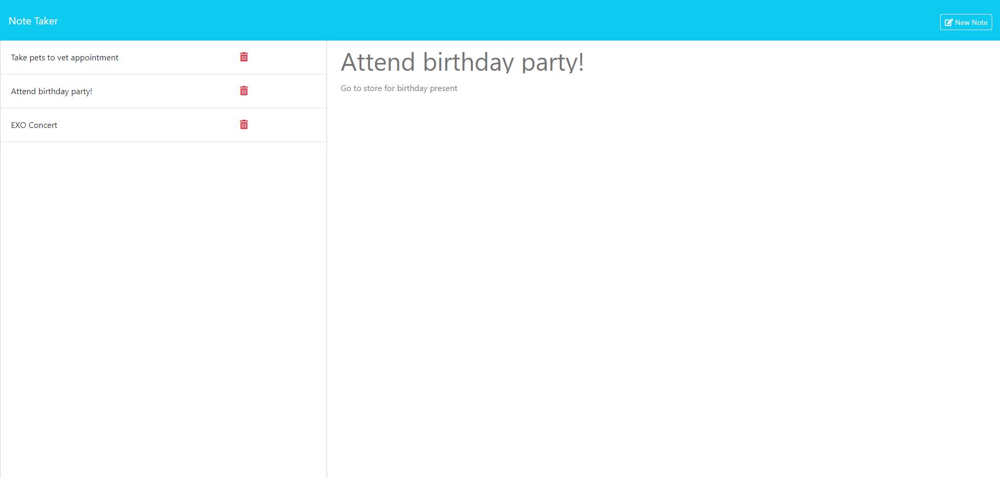
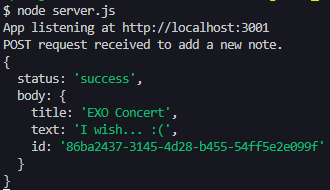
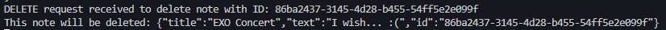
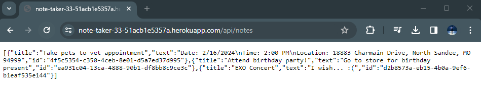
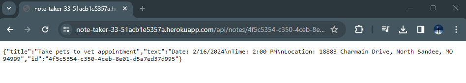

# Note Taker

## Table of Contents
- [Description](#description)
- [Features](#features)
- [Deployment](#deployment)
- [Installation](#installation)
- [Screenshots](#screenshots)
- [Credits](#credits)
- [License](#license)

## Description

This application allows you to write and save notes. The app contains a small API that allows a user or developer to:
- view all notes,
- view specific note based on its ID,
- save new notes,
- and delete notes.

Please visit the deployed app on Heroku: [https://note-taker-33-51acb1e5357a.herokuapp.com/](https://note-taker-33-51acb1e5357a.herokuapp.com/) or reference the [Installation](#installation) instructions below to run it locally.

## Features

* [Node.js](https://nodejs.org/en) to execute JavaScript in CLI or *outside* of web browser.
* [Express.js](https://expressjs.com/) to implement back-end web framework for routing, middleware, and API.
* [UUID](https://www.npmjs.com/package/uuid) to generate a randomized UUID for each note.

## Deployment

Please visit the deployed app on Heroku: [https://note-taker-33-51acb1e5357a.herokuapp.com/](https://note-taker-33-51acb1e5357a.herokuapp.com/)

## Installation

1. Download [Node.js](https://nodejs.org/en).
2. Download repo files by [cloning the repo](https://docs.github.com/en/repositories/creating-and-managing-repositories/cloning-a-repository#cloning-a-repository) or [downloading the ZIP folder](https://github.com/apri1mayrain/note-taker/archive/refs/heads/main.zip). If downloading ZIP folder, please be sure to extract the folder.
3. Open your preferred command line interface.
3. Navigate to the file directory containing the repo.
4. Install the Express.js and UUID NPM with command: `npm install`
5. Start the app on local server with command: `npm start` or `node server.js`

## Screenshots

Website preview:

Saving new note:

Deleting a note:

Using API to view all notes:

Using API to view specific note based on its ID:

## Credits

* Starter code: [https://github.com/coding-boot-camp/miniature-eureka](https://github.com/coding-boot-camp/miniature-eureka)

* Researched Stack Overflow forums and other coding resources.

## License

MIT License - Copyright © 2024 apri1mayrain

[(Go back to top)](#note-taker)

